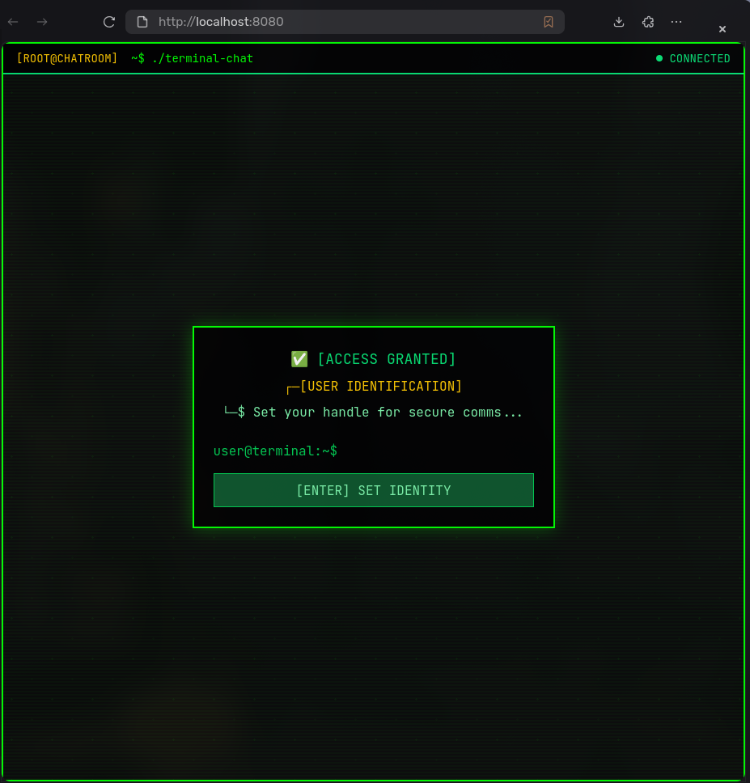
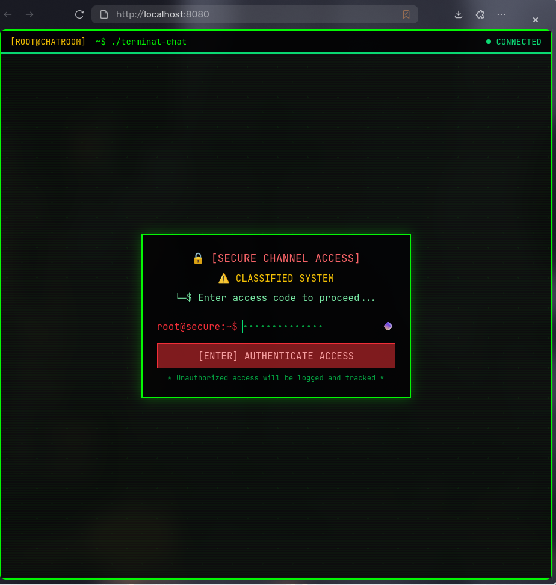
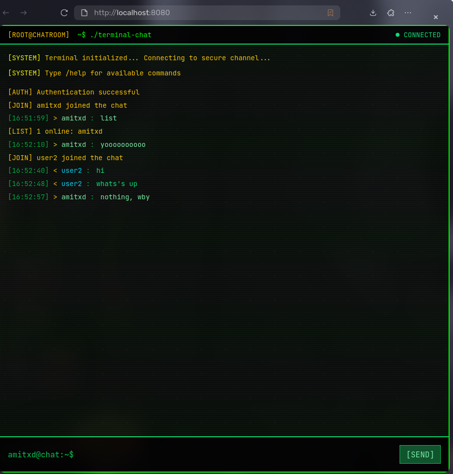

## Realtime Chat

Password-gated realtime chat with symmetric encryption. This is a learning project focused on WebSockets; it is not a hardened or audited system.

- **Backend**: Rust (Tokio + tokio-tungstenite). Auth via shared password; AES-256-GCM encryption with key derived from password (SHA-256).
- **Frontend**: Vanilla HTML/CSS/JS terminal-style UI. Uses Web Crypto API for AES-GCM to match the server scheme.
- **Static server**: Minimal Rust HTTP server to serve `frontend/` and `runtime config` (`/config.js`). Optional live-reload for local dev. Uses centralized ANSI colors in `http-serve/src/colors.rs` (no hardcoded escape codes).
- **Docker**: Docker images and `docker-compose.yml`.


### Screenshots

| Login | Auth | Chat |
|---|---|---|
|  |  |  |


### Features
- **Encryption (symmetric)**: AES-256-GCM using a 256-bit key derived as SHA-256(password). No key exchange or forward secrecy.
- **Password gate**: Must authenticate before joining.
- **Runtime config**: Frontend reads `WS_URL` from `/config.js` so you can deploy behind different domains without rebuilding.
- **Simple ops**: One command `docker compose up -d` to run both services.

## Architecture

- **backend** (`realtime-chat`)
  - Listens on `HOST:PORT` (default `0.0.0.0:9001`) for WebSocket connections
  - First message must be `{ "password": "..." }`
  - Broadcasts encrypted messages to all peers
  - Files: `backend/src/{main.rs,server.rs,config.rs,encryption.rs,types.rs}`

- **http-serve**
  - Serves static files from `ROOT_DIR` (default `frontend/`) on `HOST:PORT` (default `0.0.0.0:8080`)
  - Serves `/config.js` exposing `window.__RUNTIME_CONFIG__.WS_URL`
  - Optional file-watcher live-reload for local dev

- **frontend**
  - `index.html` uses Tailwind CDN and `js/main.js`
  - Performs auth, sets username, encrypts outbound messages, decrypts inbound

## Directory structure

```text
.
├─ backend/
│  ├─ Cargo.toml
│  └─ src/
│     ├─ main.rs          # Entrypoint: loads config and starts server
│     ├─ config.rs        # HOST/PORT/SERVER_PASSWORD loader
│     └─ types.rs         # Message types
│     ├─ server/mod.rs        # WebSocket accept loop, auth, broadcast
│     ├─ encryption/mod.rs    # AES-256-GCM helpers (SHA-256 key derivation)
├─ http-serve/
│  ├─ Cargo.toml
│  ├─ Dockerfile
│  └─ src/                # Static HTTP server + /config.js
│     ├─ main.rs
│     ├─ colors.rs        # ANSI color constants
│     ├─ config.rs        # env + CLI
│     ├─ server/          # listener + startup info
│     ├─ websocket/       # live reload WS
│     ├─ handlers.rs      # HTTP handlers, MIME, responses
│     └─ watcher.rs       # file watcher + reload broadcast
├─ frontend/
│  ├─ index.html
│  ├─ styles.css
│  └─ js/
│     ├─ main.js          # Client app
│     ├─ ui.js            # DOM helpers
│     ├─ crypto.js        # WebCrypto AES-GCM (SHA-256 key)
│     └─ utils.js         # Small helpers
├─ docker-compose.yml
├─ .env                    # Runtime env (not committed)
├─ .env.example            # Sample env (commit this)
└─ Cargo.toml              # Workspace
```

## Requirements

- Rust 1.85+ (edition 2024)
- Docker 24+ and Docker Compose v2 (for containerized deployment)

## Quick start (local dev)

1) Configure environment
```bash
cp .env.example .env
${EDITOR:-nano} .env
```

2) Run backend
```bash
cd backend
cargo run
```

3) Run static server
```bash
cd http-serve
cargo run -- --root ../frontend --port 8080
```

4) Open the app at `http://localhost:8080`

## Run with Docker (recommended for production)

```bash
cp .env.example .env
# Set a strong SERVER_PASSWORD; set WS_URL to your public wss:// URL if using TLS
docker compose up -d --build
```

- Frontend: `http://localhost:8080`
- Backend WS: `ws://localhost:9001`

To update:
```bash
docker compose pull && docker compose up -d --build
```

## Environment variables

- **Backend**
  - `BACKEND_HOST` (default `0.0.0.0`)
  - `BACKEND_PORT` (default `9001`)
  - `BACKEND_BIND_ADDR` (optional; overrides HOST/PORT)
  - `SERVER_PASSWORD` (required)

- **Static server (http-serve)**
  - `FRONTEND_HOST` (default `0.0.0.0`)
  - `FRONTEND_HPORT` (default `8080`)
  - `ROOT_DIR` (default `frontend`)
  - `LIVE_RELOAD` (default `true` locally; disabled in Dockerfile)
  - `WS_URL` (optional; if set, exposed via `/config.js`)

## WebSocket protocol

All frames are text frames with JSON payloads.

- **Authenticate (client → server first message)**
```json
{ "password": "<SERVER_PASSWORD>" }
```

- **Auth response (server → client)**
```json
{ "success": true, "message": "Authentication successful" }
```

- **Join (client → server)**
```json
{ "username": "alice", "message_type": "join" }
```

- **Encrypted chat (client → server)**
```json
{
  "user_id": "",
  "username": "alice",
  "encrypted_message": "<base64>",
  "nonce": "<base64-12-byte>",
  "timestamp": "2025-01-01T00:00:00Z",
  "message_type": "message"
}
```

- **Encrypted broadcast (server → clients)**
```json
{
  "user_id": "...",
  "username": "alice",
  "encrypted_message": "<base64>",
  "nonce": "<base64-12-byte>",
  "timestamp": "...",
  "message_type": "message" | "join" | "leave"
}
```

## Production deployment notes

- **Transport**: The bundled static server speaks HTTP/1.1. If you expose this app, terminate TLS at a reverse proxy and set `WS_URL` to a `wss://` URL. Without TLS, traffic can be intercepted/modified.
- **Reverse proxy examples**

Nginx (snippet):
```nginx
server {
  listen 80;
  server_name chat.example.com;
  location / {
    proxy_pass http://frontend:8080;
  }
}

server {
  listen 443 ssl;
  server_name ws.example.com;
  ssl_certificate /path/fullchain.pem;
  ssl_certificate_key /path/privkey.pem;
  location / {
    proxy_set_header Upgrade $http_upgrade;
    proxy_set_header Connection "upgrade";
    proxy_http_version 1.1;
    proxy_pass http://backend:9001;
  }
}
```

Caddy (snippet):
```caddyfile
chat.example.com {
  reverse_proxy frontend:8080
}

ws.example.com {
  reverse_proxy backend:9001
}
```

## Security model and limitations

- Single shared password used to derive a symmetric key (via SHA-256). All clients with the password can decrypt all messages.
- No key exchange, no forward secrecy, no user-level authentication or authorization.
- Without TLS (`wss://`), the password and ciphertext can be observed and traffic modified by on-path attackers.
- Message metadata (usernames, types, timestamps) may be visible depending on implementation.
- Frontend optionally stores the password and username in cookies for convenience. This is sensitive; prefer HTTPS-only deployments and consider disabling auto-login in untrusted environments.
- The included HTTP server is minimal and intended for local/dev or to be placed behind a proper reverse proxy.

Operational tips:
- Use a strong `SERVER_PASSWORD` and rotate it.
- Put both HTTP and WS behind TLS via a reverse proxy.
- Restrict inbound access to required ports only.

- **Observability**
  - Backend logs connection lifecycle and broadcasts to stdout
  - Add container log shipping (e.g., to your centralized logging)

## License

MIT or your preferred license.
